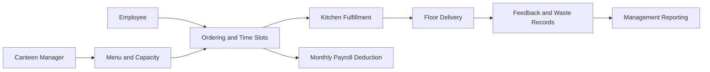
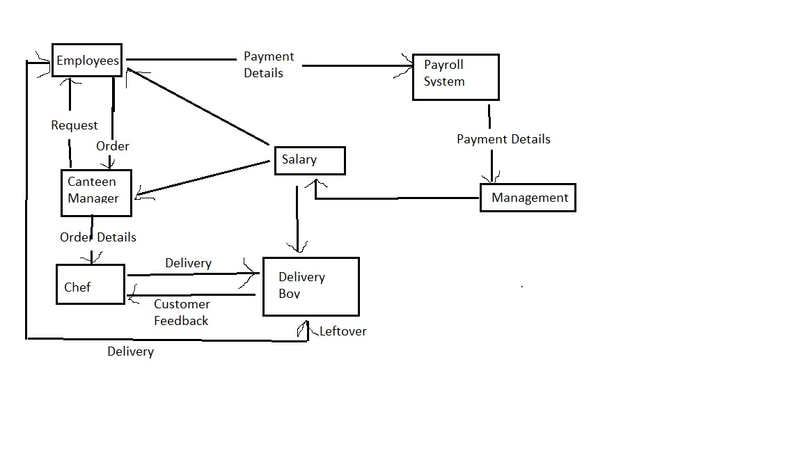
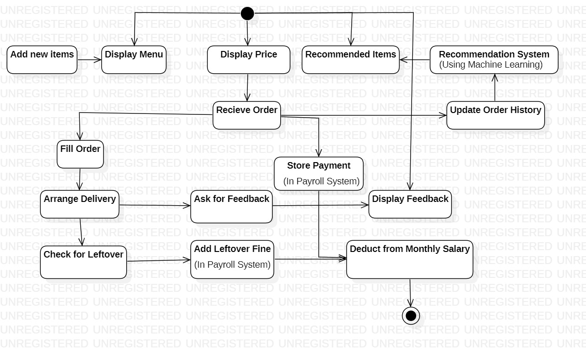
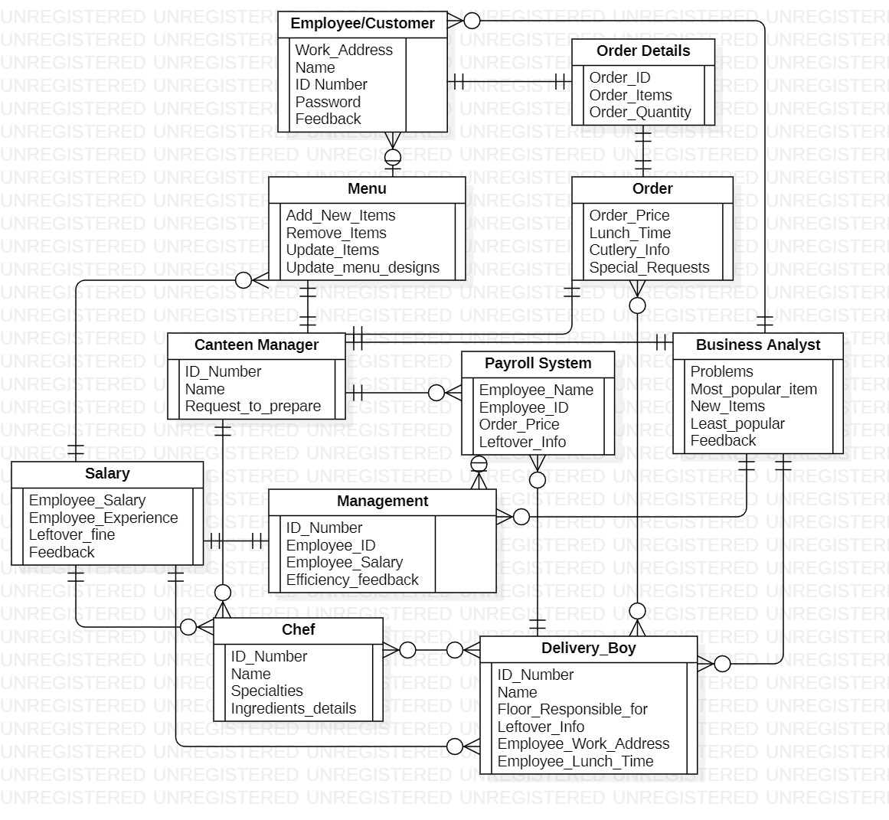

# Workplace Canteen Ordering System

**Business-analysis and system-design case study for reducing cafeteria queues, food waste, and operational cost in a large office.**

## Problem Statement

The case study models a canteen serving approximately 600 employees during a one-hour lunch window with only 150 seats. Employees can spend 30-35 minutes queueing and waiting for seating, while popular items sell out and unselected food is discarded.

## Proposed Product

- Employees pre-order lunch before an 11:00 AM cutoff.
- Time slots distribute kitchen demand across floors.
- Orders are delivered to workstations.
- Canteen managers publish menus and coordinate fulfillment.
- Feedback and leftover records support demand planning and waste reduction.
- Payroll integration aggregates monthly meal charges.

## Target KPIs

These are proposed business targets, not measured production outcomes:

| KPI | Target |
| --- | --- |
| Food waste | Reduce by at least 30% within 6 months |
| Operating cost | Reduce by 15% within 12 months |
| Productive time | Recover 30 minutes per employee per day within 3 months |
| Staffing model | Evaluate a reduction from 30-32 to 12-14 canteen staff |
| Peak capacity | Support at least 400 concurrent orders and 1,500 employees |

## Architecture

## System Models

### Context diagram

### Activity diagram

### Entity-relationship diagram

## Stakeholders

- Employees ordering and reviewing food
- Canteen managers managing menus, orders, prices, and waste
- Kitchen and delivery staff fulfilling floor-level orders
- Payroll handling approved deductions
- Management reviewing cost, waste, and service quality

## Artifacts

- `Project Solution.docx`: requirements, scope, stakeholders, and KPI proposal
- `Main UI.docx`: interface concepts
- Diagram images: context, activity, and data models

## Security and Ethics

- Access should be restricted to employees and authorized operators.
- Payroll deductions require clear consent, reconciliation, and dispute handling.
- A punitive leftover-fine feature presents fairness and labor-policy risks; a real implementation should favor opt-in nudges, portion selection, and aggregate waste analytics.
- Payment and employment data require role-based access, audit logs, retention limits, and privacy review.

## Future Improvements

- Validate assumptions with employees, kitchen staff, and facilities teams
- Prototype demand forecasting from historical orders
- Replace punitive waste controls with behavioral experiments
- Add accessibility, dietary, allergen, and multilingual requirements
- Define an experiment plan for queue time, waste, satisfaction, and adoption
